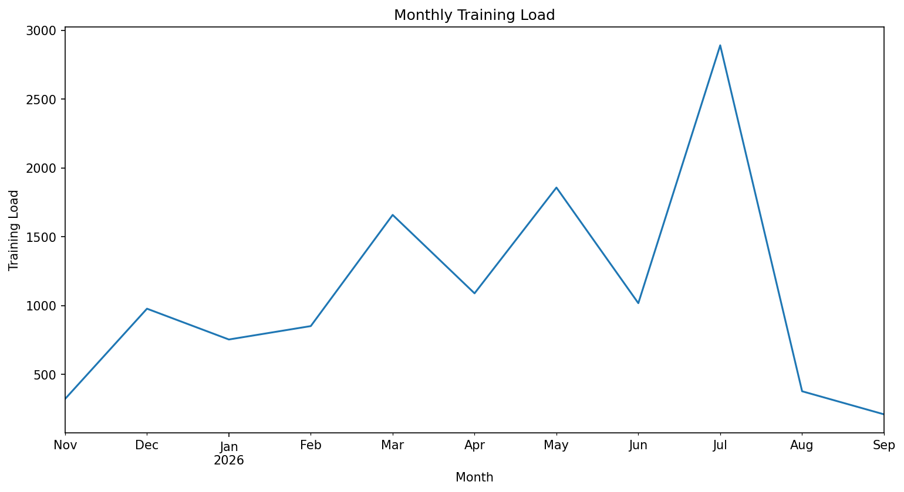
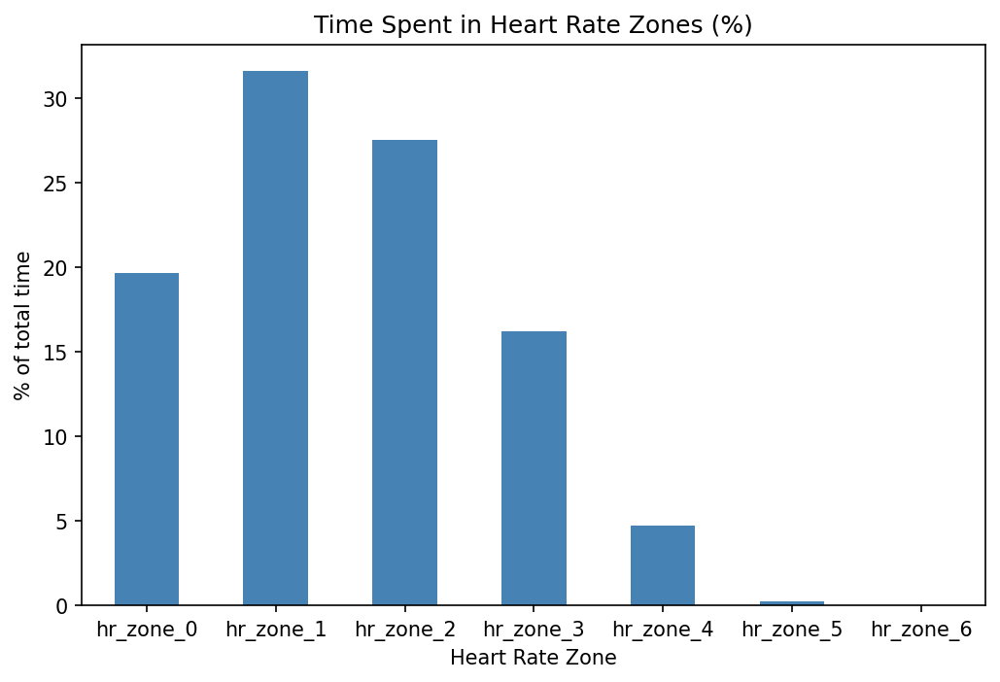

# Garmin Training Analytics 🚣

An end-to-end data analysis project exploring my own training data (rowing, 
running, strength training) exported from Garmin Connect - going from raw 
JSON exports to actionable insights about training load, heart rate zones, 
and performance trends over time.

## Motivation

As a competitive rower, I generate large amounts of structured training data 
every week. This project applies SQL, data analysis, and visualization to 
answer real questions about my own training: Am I training in the right 
heart rate zones? How does training load evolve over a season? Are there 
patterns between strength training and on-water performance?

## Tech Stack

- **Python** - Pandas, NumPy for data processing
- **SQL** (SQLite) - data storage and aggregation queries
- **Matplotlib / Seaborn** - visualization
- **Jupyter Notebook** - analysis and reporting

## Pipeline

1. **Extract** - raw activity data exported from Garmin Connect (JSON)
2. **Load** - parsed and loaded into a local SQLite database
3. **Transform & Analyze** - SQL queries for aggregation, Pandas/NumPy for 
   further processing and statistics
4. **Visualize** - charts summarizing trends and key findings

## Key Questions Explored

- How has my weekly training load changed over time?
- What percentage of training time is spent in each heart rate zone?
- Is there a relationship between strength training volume and rowing performance?
- Are there identifiable training blocks (base, intensity, taper)?

## Project Structure
```
garmin-training-analytics/
├── data/
│   ├── raw/              # oryginalne pliki JSON z Garmina (gitignored — prywatne dane)
│   └── processed/        # baza SQLite po przetworzeniu (gitignored)
├── sql/
│   └── queries.sql       # zapytania SQL użyte w analizie
├── src/
│   ├── etl.py            # Extract-Load: JSON -> SQLite
│   └── analysis.py       # funkcje pomocnicze do agregacji/statystyk
├── notebooks/
│   └── analysis.ipynb    # główna analiza + wizualizacje
├── visuals/              # zapisane wykresy (do wklejenia w README)
├── requirements.txt
├── .gitignore
└── README.md
```
## Setup

```bash
pip install -r requirements.txt
```

## Findings

Training load peaked in July 2026, which matches my preparation period for the Polish National Championships. Heart rate zone analysis showed I spend around 60% of my training time in Zones 1-2, consistent with a polarized training approach common in endurance sports. Indoor rowing sessions also showed a noticeably higher average heart rate (142 bpm) than on-water rowing (124 bpm), likely due to the more continuous nature of ergometer training compared to the variable pacing of water sessions.

**Note:** Garmin only started tracking `training_load` and detailed heart rate 
zone data in November 2025. Charts and analysis involving these metrics 
therefore cover the November 2025 - September 2026 period only.





## Author

Mikołaj Filka
